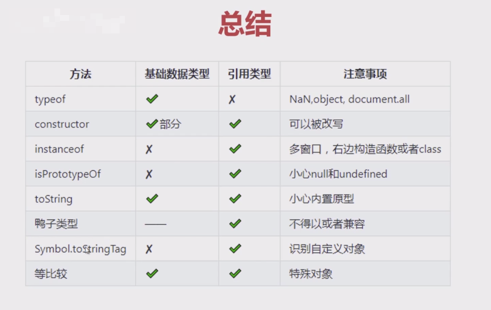

# 数据类型

## 问答

Q1：为什么 typeof null 的返回值是"object"?

在 JavaScript 的第一个版本，单个字在栈中占有 32 位存储单元，分为：标记位+数据，且只有 5 中数据类型：

- 000: object;
- 001: integer;
- 010: double;
- 100: string;
- 110; boolean;

null 的机器码是 32 位 "0"，由于标记位为： "000"，所以 typeof 返回的是 "object"

Q1.1 为什么不修复这个问题？

主要是考虑兼容问题

Q2：一元运算符 "+" 转为数字有什么问题？

在 ES5 中可以执行，但在 es6 中 bigInt 和 Symbol 数据类型转换会抛出异常。

**tips: 代码即需要考虑向前兼容，也要考虑向后兼容。**

```js
function toNum(val) {
  return val >> 0;
}

function toNum2(val) {
  return val >>> 0;
}
```

- 一个数值转为二进制的时候，进制数大于 32 位，它就是不准确的；
- 有符号数字，最高位为符号位
  - 十进制转二进制：原码 -> 反码 + 1
  - 二进制转十进制：减一 -> 反码 = 原码

**通过位移把一个对象转为数字的时候，如果转换后大于 Number.MAX_SAFE_INTEGER，注意对 BigInt 或 Symbol 转换也会抛出异常。**

Q3：字符串批量转换为整数

3.1 parseInt 第二个参数的取值范围?

> 语法：parseInt(string, radix)

radix 是 2-36 之间的整数，表示被解析字符串的基数。

Q4：if 判断条件

```js
const res = {};

if (obj.name) {
  res.name = obj.name;
}

return res;
```

- 判断一个对象是否有一个属性，使用 Object.prototype.hasOwnProperty 方法，检测一个对象是否含有特定的自身属性；和 in 运算符不同，它会忽略哪些从原型链继承的属性；
- if 的 condition 的本质是转为 Boolean；

Q5：宽松比较，本质是隐式转换

5.1 NaN，与任何值都不相等，包括它自己。

5.2 bigInt, Symbol

5.3 null，undefined

5.4 bool 类型和其它类型相等比较，会转为 数字。

5.5 数字类型和字符串类型相等比较，会转为数字。

5.6 对象类型和原始类型相等比较，对象会转为原始类型。

## 数据类型判断

1. typeof，操作数的类型，只能识别基础数据类型和引用类型。

> 特别注意：null - object，NaN - number，document.all - undefined

**注意：该操作符在 ES6 中不是绝对安全,因为暂时性死区**

2. constructor，constructor 指向创建实例对象的构造函数。

- null 和 undefined 并没有构造函数；
- constructor 可以被改写；

通常作为一种辅助方法，配合其它方法进行判定值类型。

```js
String.prototype.constructor = function fun() {
  return {};
};
```

3. instanceof，在原型链上查找，查到即是其实例。

**注意 1： 右操作数必须是函数或 class。**

**注意 2：instanceof 在跨窗口使用时，是有风险的。**

4. isPrototypeOf，是否出现实例对象的原型链上。

- 在正常返回值的情况下，基本等同 instanceof。

5. Object.prototype.toString，通过函数的动态 this 特性，返回其数据类型。

Q5.1：自定已定义对象如何获得 [object MyArray] 类型？

Q5.2：Object.prototype.toString.call(Boolean.prototype)?

6. 鸭子类型检查，检查自身，属性的类型或执行结果的类型

**通常作为一种候选方案。**

7. Symbol.toStringTag，Object.prototype.toString 会读取该值。

使用场景：需要自定义类型。

注意：兼容性问题。

8. 等比较

使用场景：undefined，window，document，null 等。

### 小结



## NaN

1. NaN 和 Number.isNaN

它们的特征：

- typeof 返回 "number";
- 不等于自己；
- 不能被删除。

2. isNaN，检查 toNumber 返回值，如果是 NaN，就返回 true，反之返回 false.

```js
// 语义化
const isNaN = function (val) {
  return Object.is(Number(val), NaN);
};
```

**注意：不是一个安全的方法。**

3. Number.isNaN，判断一个值是否是数字，并且值等于 NaN.

```js
// 语义化
Number.isNaN = function (val) {
  if (typeof val !== 'number') return false;

  return Object.is(val, NaN);
};
```

4. 严格判断 NaN 汇总

- Number.isNaN;
- 自身比较;
- Object.is;
- typeof + NaN;

5. 透过陷阱看本质

```js
const arr = [NaN];

_(arr.indexOf(NaN)); // -1
_(arr.includes(NaN)); // true
```

- includes：调用内部的 Number::sameValueZero;
- indexOf：调用内部的 Number::equal;

## 要点

1. null 和 undefined 实现的机制完全不一样

- null 是关键字；
- undefined 是一个值；

2. 知识一般分为两个维度：深度和广度。

3. 旧浏览器中，undefined 是不可靠的，在 IE8 中可以修改它，**注意：现代浏览器是改不动的。安全的做法是：void 0（void 后面接任何值都是返回 undefined）**

4. isNaN 和 Number.isNaN 的本质区别：

- isNaN：会尝试转换获取之后和 NaN 比较；
- Number.isNaN：直接判断类型，再进行值比对。

5. 在数组中查找 NaN 是 indexOf 是无法查找的，可以使用 includes。
