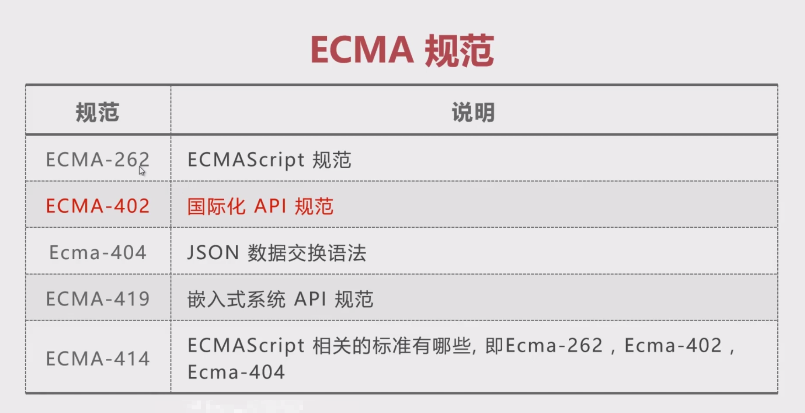

# 数据类型

## 数值千分位

1. 转字符串，整数部分低位向高位遍历

2. 字符串 + substring 截取，数字转字符串，整数部分高位向低位遍历，三位分组。

3. 正则先行断言等

```js
function format_with_regex(num) {
  const reg = /\d{1, 3}(?=(\d{3})+$)/g;

  return (num + '').replace(reg, '$&,');
}
```

4. Intl.NumberFormat

语法：new Intl.NumberFormat([locales[, options]])

国际化的数字处理方案，可以用来显示不同国家对数字处理偏好。

5. toLocalString，把数字转为特定语言环境下的表示字符串。

语法：numObj.toLocalString([locales[, options]])

## 二元操作符 +

1. 如果操作数是对象，则对象会转换为原始值。

2. 如果其中一个操作数是字符串的话，另一个操作数也会转换为字符串，进行字符串拼接。

3. 两个操作数都将转换成数字或 NaN，进行加法操作。

### 对象转为原始数据类型的值

1. Symbol.toPrimitive(优先级最高)

2. Object.prototype.valueOf

3. Object.prototype.toString

优先调用 2，如果返回原始数据类型，则直接返回。

最后调用 3

## 要点

1. ECMA 规范


