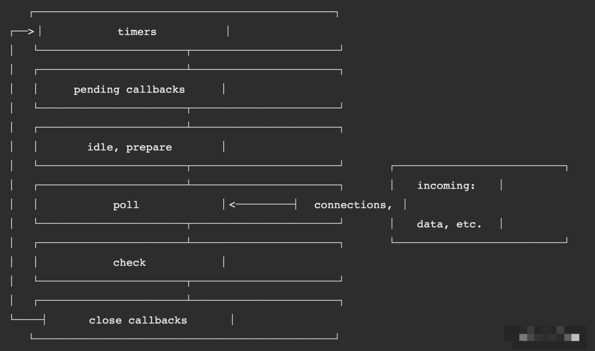
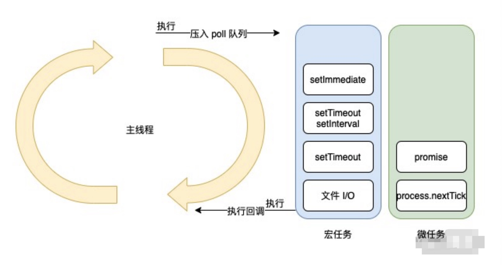

# 事件循环

> 基于 node.js 10+

1. 事件循环原理和浏览器的原理是不同的，Node.js 10+ 版本后虽然在运⾏结果上与浏览器⼀致，但是两者在原理上⼀个是基于浏览器，⼀个是基于 libuv 库。浏览器核⼼的是宏任务和微任务，⽽在 **Node.js 还有阶段性任务执⾏阶段**。

## 原理

1. **事件循环简单来说，就是一个 while 循环**，那么相关的问题是：

- 谁来启动这个循环过程，循环条件是什么？
- 循环的是什么任务呢？
- 循环的任务是否有优先级概念？
- 什么进程或线程来执行这个循环？
- 无限循环没有终点？

2. 核心流程图

### 事件循环的 6 个阶段

1. timers：本阶段执⾏已经被 setTimeout() 和 setInterval() 调度的回调函数，即由这两个函数启动的回调函数。

2. pending callbacks：本阶段执⾏某些系统操作（如 TCP 错误类型）的回调函数。

3. idle、prepare：仅系统内部使⽤

4. poll：检索新的 I/O 事件，执行与 I/O 相关的回调，其它情况 node.js 将在适当的时候在此阻塞，**这也是最复杂的⼀个阶段，所有的事件循环以及回调处理都在这个阶段执行。**

5. check：setImmediate() 回调函数在这⾥执⾏，setImmediate 并不是⽴⻢执⾏，⽽是**当事件循环 poll 中没有新的事件处理时就执⾏该部分**。

6. close callbacks：执⾏⼀些关闭的回调函数，如 socket.on('close', ...)。

7. setImmediate 与 setTimeout

- setTimeout 如果不设置时间或者设置时间为 0，则会默认为 1ms；
- 主流程执⾏完成后，超过 1ms 时，会将 setTimeout 回调函数逻辑插⼊到待执⾏回调函数 poll 队列中；
- 当前 poll 队列中存在可执⾏回调函数，因此需要先执⾏完，待完全执⾏完成后，才会执⾏ check：setImmediate。

**tips： 先执行回调函数，再执行 setImmediate**

### 运行起点

1. ⼀个⾮常关键点，当 Node.js 启动后，会初始化事件循环，处理已提供的输⼊脚本，它可能会先调⽤⼀些异步的 API、调度定时器，或者 process.nextTick()，然后再开始处理事件循环。因此可以这样理解，**Node.js 进程启动后，就发起了⼀个新的事件循环，也就是事件循环的起点。**

2. Node.js 事件循环的发起点有 4 个：

- node.js 启动后
- setTimeout 回调函数
- setInterval 回调函数
- 也可能是一次 I/O 后的回调函数

### 事件循环

1. 。在 poll 过程中，主要处理的是异步 I/O 的回调函数，以及其他⼏乎所有的回调函数，异步 I/O ⼜分为⽹络 I/O 和⽂件 I/O。

2. 事件循环主要包含：微任务和宏任务

3. 微任务在 Node.js 中微任务包含 2 种⸺process.nextTick 和 Promise。微任务在事件循环中优先级是最⾼的，因此在同⼀个事件循环中有其他任务存在时，优先执⾏微任务队列。并且 process.nextTick 和 Promise 也存在优先级，process.nextTick ⾼于 Promise。

4. 宏任务：在 Node.js 中宏任务包含 4 种⸺setTimeout、setInterval、setImmediate 和 I/O。宏任务在微任务执⾏之后执⾏，因此在同⼀个事件循环周期内，如果既存在微任务队列⼜存在宏任务队列，那么优先将微任务队列清空，再执⾏宏任务队列。

5. 一个核心的主线程，执行阶段主要处理三个核心逻辑：

- 同步代码
- 将异步任务插⼊到微任务队列或者宏任务队列中
- 执⾏微任务或者宏任务的回调函数。在主线程处理回调函数的同时，也需要判断是否插⼊微任务和宏任务。根据优先级，先判断微任务队列是否存在任务，存在则先执⾏微任务，不存在则判断在宏任务队列是否有任务，有则执⾏。

6. 主线程会被阻塞吗？

**注意：主线程会因为回调函数的执行而阻塞。**

7. 当所有的微任务和宏任务都清空的时候，虽然当前没有任务可执⾏了，但是也并不能代表循环结束了。因为可能存在当前还未回调的异步 I/O，所以这个循环是没有终点的，只要进程在，并且有新的任务存在，就会去执⾏。

## 实践

1. **node.js 不善于处理 CPU 密集型的业务，** 会导致性能问题，要实现⼀个耗时 CPU 的计算逻辑，处理⽅法有 2 种：

- 直接在主业务流程中处理；
- 通过网络异步 I/O 给其它进程处理

2. 异步网络 I/O 充分利用了 node.js 的异步事件驱动能力，将耗时 CPU 计算逻辑给其它进程来处理，无须等待耗时 CPU 计算，可以直接处理其它请求或者其它部分逻辑

## 要点

Q：node.js 是单线程的还是多线程的？

1. **主线程是单线程执行的，但是 node.js 存在多线程执行，多线程包括 setTimeout 和异步 I/O 事件，以及存在其它的线程，如：垃圾回收，内存优化等。**

Q2：浏览器的事件循环原理和 Node.js 事件循环原理的区别以及联系有哪些点？

浏览器和 node 的事件循环机制是⼀样的，主线程、微任务、宏任务执⾏逻辑都没有差异，区别在于浏览器中没有 process.nextTick()和 I/O

2. 还可以利⽤ settimeout 来判断主线程是否被 block，如果
   setimeout 延迟执⾏的时间-真实执⾏的时⻓ > 0 时则代表主线程有压⼒。
