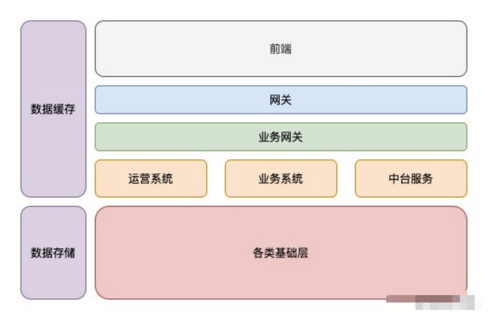

# 应用场景

## 服务分类

1. 我们常听说的服务有 RESTful 和 RPC，但这都是架构设计规范。

2. 后台服务分类：

3. 网关：处理请求转发和一些通用的逻辑，如：Nginx。

4. 业务网关：处理业务相关逻辑，如：一些通用的协议转化，通用的鉴权处理，以及其它统一的业务安全处理等。

5. 运营系统，负责我们⽇常的运营活动或者运营系统；

6. 业务系统，负责我们核⼼的业务功能的系统；

7. 中台服务：负责一些通用 App 类的服务，如：配置下发、消息系统以及用户反馈系统等。

8. 各类基础层：单一的核心后台服务，如：用户模块，需要根据不同业务设计不同的核⼼底层服务；

9. 数据缓存和数据存储，则是相应的数据类的服务。

10. 在这些分层中，我们需要寻找⽹络 I/O 较多，但是 CPU 计算较少、业务复杂度⾼的服务:

- 业务网关
- 中台服务
- 运营系统

### 业务网关

1. 提炼一层业务网关，专门处理业务相关的通用逻辑，如：鉴权模块。

#### 业务场景

1. OPEN API ⼀般会有⼀个统⼀的 token 鉴权，通过 token 鉴权后还需要判断第三⽅的 appid 是否有接⼝权限，其次判断接⼝是否到达了请求频率上限。为了服务安全，我们也可以做⼀些降级处理，在服务过载时，可以根据优先级抛弃⼀些请求。

2. node.js 的优势，异步驱动的方案能够处理更高的并发。

### 中台服务

1. 在 Web 或者 App 应⽤中都存在⼀些通⽤服务，以往都是独⽴接⼝、独⽴开发。随着公司应⽤越来越多，需要将一些通用的业务服务进行集中，**即中台的概念。**

> 这部分业务场景也是：网络 I/O 高，并发较大，业务关联性高，数据库读写压力相对较小。

#### 业务场景

1. 中台服务系统：

- 前端配置系统
- 反馈系统
- 推送系统
- 系统工具

2. 前端配置系统：在服务端根据客户端的版本、设备、地区和语言，下发不同的配置(json 或文件包)。

3. 反馈系统：用户可以在任何平台，调用反馈接口，将反馈内容写入队列，并落地到系统中进行综合分析。

4. 推送系统：管理消息的推送、用户红点和消息数的拉取以及消息队列的管理。

5. 系统工具：

- 处理用户端日志捞取
- 用户端信息调试上报
- 性能定位问题分析提取

6. 服务特性，在中台系统的设计中，系统着重关注：

- 网络 I/O
- 并发
- 通用性
- 业务复杂度

**⼀般情况下不涉及复杂的 CPU 运算。**

7. node.js 作为中台服务，要求是：

- 通用性必须好
- 低 cup 计算
- 网络 I/O 高或低即可。
- 并发高或低即可。

这样的服务在 Node.js 主线程中，可以快速处理各类业务场景，不会存在阻塞的情况，因此这类场景也适合使⽤ Node.js 作为服务端语⾔。

### node.js 不适合场景

> 密集型 CPU 运算的服务非常不适合使用 node.js 来处理。

1. 图片处理，⽐如图⽚的裁剪、图⽚的缩放，这些⾮常损耗 CPU 计算，应该⽤其他进程来处理；

2. ⼤字符串、⼤数组类处理，当涉及这些数据时，应该考虑如何通过切割来处理，或者在其他进程异步处理；

3. ⼤⽂件读写处理，有时会使⽤ Node.js 服务来处理 Excel，但是遇到 Excel 过⼤时，会导致 Node.js 内存溢出，因为 V8 内存上限是 1.4 G。

**tips： 大内存或 CPU 密集，这样的场景都不合适使用 node.js 来提供服务。**

## 要点

1. CPU 密集型业务的一个方案：

- 最好⽤ C 来处理，写⼀个异步 Node.js 扩展的⽅式，在
  Node.js 来应⽤。在实践开发中，这类情况，特别是⼀些⾮常基础的模块，可以这样处理。
